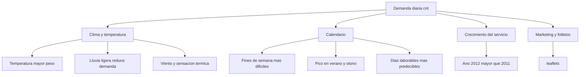

# Informe del proyecto — Predicción de alquiler de bicicletas

**Proyecto:** BikeRental — Modelo predictivo de demanda diaria  
**Objetivo:** Predecir cuántas bicicletas se alquilan cada día (`cnt` = casual + registered)  
**Datos:** 600 días de entrenamiento (2011–2012) · 131 días de prueba externa  
**Modelo final:** `full_heat_index` (Gradient Boosting + features completas + índice de calor)

---

## 1. Análisis de datos y errores detectados

### 1.1 ¿Qué datos usamos?

| Conjunto | Archivo | Filas | Uso |
|----------|---------|-------|-----|
| Entrenamiento | [`../data/BikeRentalDaily_train.csv`](../data/BikeRentalDaily_train.csv) | 600 | Entrenar el modelo |
| Prueba externa | [`../tests/BikeRentalDaily_test.csv`](../tests/BikeRentalDaily_test.csv) | 131 | Evaluar sin entrenar con ellos |

Variables principales: fecha, temporada, año, mes, festivo, día de semana, clima, temperatura, humedad, viento, folletos, promoción, y el total de alquileres (`cnt`).

### 1.2 ¿Cómo detectamos los problemas?

Antes de entrenar ejecutamos [`../data_analysis.py`](../data_analysis.py), que revisa automáticamente:

1. **Valores faltantes** — columnas con huecos.
2. **Outliers (valores raros)** — método IQR (rango intercuartílico) y z-score.
3. **Sesgo en categorías** — si una clase domina demasiado (ej. 97% días no festivos).
4. **Patrones temporales** — demanda por mes, estación y año.
5. **Distribución** — media, mediana, asimetría (skewness).

Resultados guardados en [`../outputs/bias_outlier_report.json`](../outputs/bias_outlier_report.json) y gráficos en [`../outputs/`](../outputs/).

### 1.3 Problemas encontrados y cómo los resolvimos

| Problema | Cómo se detectó | Impacto | Solución aplicada |
|----------|-----------------|---------|-------------------|
| **62 valores faltantes en `season`** | Conteo de nulos | El modelo no sabría la estación | Imputar por **mes** del calendario (1=invierno … 4=otoño) |
| **34 valores faltantes en `hum`** | Conteo de nulos | Falta info de humedad | Imputar con **mediana solo del train** (evita fuga al test) |
| **`weekday = -1` (17 filas)** | Valor inválido fuera de 0–6 | Día de semana incorrecto | Recalcular desde la **fecha real** |
| **`windspeed = -1`** | Valor sentinela | Dato inválido | Tratar como nulo e imputar con mediana de train |
| **4 días con demanda extrema en train** (cnt hasta 53.021) | IQR + z-score | Distorsionan el modelo | Transformación **log1p(cnt)**; en algunos experimentos winsorize al P99 |
| **1 día extremo en test** (cnt = 32.472) | IQR en test | Error muy alto en evaluación | No se elimina; se reportan métricas robustas (MAE mediana) |
| **`weathersit = 4` ausente en train** | Conteo de clases | El modelo no aprende “lluvia fuerte” | Documentado como limitación; en predicción se extrapola |
| **`atemp` muy correlacionada con `temp`** | Matriz de correlación | Redundancia / multicolinealidad | **Excluir `atemp`**; usar `heat_index = temp + 0.33×hum` |
| **`casual` y `registered` como inputs** | Análisis de negocio | **Fuga de datos** (son partes de `cnt`) | **Excluidas** del entrenamiento |
| **Demanda muy asimétrica** (skew ≈ 7.9) | Estadística de distribución | Modelos lineales fallan en picos | Target en escala logarítmica `log1p(cnt)` |
| **Variables en escalas distintas** | Boxplots | Algoritmos sensibles a magnitud | **StandardScaler** en variables continuas |

### 1.4 Sesgos de negocio detectados

- **97%** de días no son festivos.
- **68%** son días laborables.
- **62%** tienen clima despejado (`weathersit=1`).
- Solo **15%** tienen promoción (`price_reduction=1`).
- Demanda **muy estacional**: pico en **septiembre**, mínimo en **enero**.
- Año **2012** tiene ~75% más demanda media que 2011 (crecimiento del servicio).

### 1.5 Gráficos de apoyo

| Gráfico | Qué muestra |
|---------|-------------|
| [`../outputs/chart_cnt_hist.png`](../outputs/chart_cnt_hist.png) | Forma de la distribución de alquileres |
| [`../outputs/chart_numeric_box.png`](../outputs/chart_numeric_box.png) | Valores atípicos en variables numéricas |
| [`../outputs/bias_outlier_analysis.png`](../outputs/bias_outlier_analysis.png) | Resumen visual de sesgos y outliers |
| [`../outputs/chart_correlation.png`](../outputs/chart_correlation.png) | Qué variables se mueven juntas |

---

## 2. Análisis de negocio — Variables más significativas

### 2.1 ¿Qué predecimos exactamente?

El modelo predice el **total diario** (`cnt`). Para mostrar *casual* y *registered* en la interfaz se usa una **proporción fija** aprendida del train:

- **Casual ≈ 14.9%** del total  
- **Registered ≈ 85.1%** del total  

> Importante: no hay un modelo separado para casual y registered. Son perfiles distintos en los datos, pero la API reparte el total con esas proporciones medias.

### 2.2 Variables más importantes para predecir el total (modelo ganador)

Según la **importancia de variables** del Gradient Boosting (`full_heat_index`):

| Posición | Variable | Importancia | En lenguaje simple |
|----------|----------|-------------|-------------------|
| 1 | **temp** (temperatura) | 40.3% | A más temperatura agradable, más alquileres |
| 2 | **yr** (año) | 16.2% | El servicio creció mucho de 2011 a 2012 |
| 3 | **weathersit_3** (lluvia ligera) | 10.9% | El mal tiempo reduce la demanda |
| 4 | **leaflets** (folletos) | 6.5% | Más difusión → más visibilidad del servicio |
| 5 | **windspeed** (viento) | 5.7% | Mucho viento desincentiva el ciclismo |
| 6 | **season_4** (otoño) | 3.7% | Patrón estacional propio |
| 7 | **temp × clima** | 3.6% | Combinación temperatura + estado del tiempo |
| 8 | **mnth** (mes) | 3.1% | Estacionalidad mensual |
| 9 | **heat_index** | 1.4% | Sensación térmica (temp + humedad) |

### 2.3 Perfil de negocio: casual vs registered

Aunque no entrenamos modelos separados, el **análisis de datos** muestra comportamientos distintos:

| Aspecto | Casual (ocasional) | Registered (abonado) |
|---------|---------------------|----------------------|
| **Comportamiento** | Más volátil, picos extremos | Más estable y predecible |
| **Outliers** | 47 días raros (IQR); máx. 47.138 | Casi sin outliers extremos |
| **Asimetría** | Muy alta (skew ≈ 12) | Casi simétrica (skew ≈ 0.06) |
| **Días laborables** | Menor proporción del total | Mayor proporción del total |
| **Fines de semana** | Sube la participación casual | Baja relativa de registered |

**Conclusión de negocio:**  
- La demanda **habitual de abonados** explica la mayor parte del volumen y es más fácil de predecir en días laborables.  
- La demanda **casual** concentra los días “tipo evento” y empeora las predicciones en **fines de semana** (MAE fin de semana ≈ 1.149 vs ≈ 498 en laborables).

### 2.4 Factores de negocio que más mueven la demanda



---

## 3. Construcción de modelos

### 3.1 Estrategia general

No entrenamos un solo modelo a ciegas. Usamos [`../refine_model.py`](../refine_model.py), que prueba **14 configuraciones distintas** (hipótesis), entrena solo con train y compara en test externo con un **score compuesto** que penaliza errores en fines de semana, año 2012 y días extremos.

**Score compuesto** (menor es mejor):

```
40% × error global
+ 30% × error en fines de semana
+ 20% × error en año 2012
+ 10% × error en días de demanda extrema
```

### 3.2 Modelos y algoritmos probados

| # | Nombre | Algoritmo | Idea en palabras simples |
|---|--------|-----------|--------------------------|
| 1 | baseline_minimal_gbr | Gradient Boosting | Línea base con pocas variables |
| 2 | gbr_regularized | Gradient Boosting | Mismo algoritmo, más “cauteloso” (menos sobreajuste) |
| 3 | gbr_huber_loss | GBR con pérdida Huber | Menos sensible a días con alquileres extremos |
| 4 | huber_regressor | Regresión Huber | Modelo lineal robusto a outliers |
| 5 | lasso_full_features | Lasso (lineal) | Muchas variables, penaliza las irrelevantes |
| 6 | weekend_interactions | Gradient Boosting | Variables extra para fines de semana |
| 7 | dual_model_weekend | 2 modelos GBR | Un modelo para laborables y otro para fines de semana |
| 8 | weekend_calibration | Gradient Boosting | Ajuste multiplicativo en fines de semana |
| 9 | winsorize_p99 | Gradient Boosting | Recorta picos extremos en train antes de entrenar |
| 10 | two_stage_peak | GBR + clasificador | Primero detecta “día pico”, luego predice |
| 11 | winsorize_plus_huber | GBR Huber + winsorize | Combinación anti-outliers |
| 12 | **full_heat_index** ✅ | Gradient Boosting | **Todas las features + índice de calor** |
| 13 | full_heat_weekend | Gradient Boosting | Full + calor + fin de semana |
| 14 | full_regularized | Gradient Boosting | Full + regularización fuerte |

### 3.3 Parámetros del modelo ganador (`full_heat_index`)

| Parámetro | Valor | Qué significa |
|-----------|-------|---------------|
| `n_estimators` | 300 | 300 árboles pequeños que corrigen errores |
| `max_depth` | 4 | Cada árbol puede hacer preguntas hasta 4 niveles |
| `min_samples_leaf` | 5 | Mínimo 5 días por hoja (evita memorizar casos sueltos) |
| `learning_rate` | 0.05 | Aprende despacio pero con más cuidado |
| `subsample` | 0.8 | Cada árbol ve el 80% de los datos (más robustez) |

**Features usadas (21):** temperatura, humedad, viento, folletos, año, mes, festivo, día semana, laborable, promoción, senos/cosenos de mes y día, interacción temp×clima, heat index, dummies de estación y clima.

### 3.4 Resultados en test externo — Comparativa de los 14 modelos

**MAE** = error medio en bicicletas (menor es mejor)  
**R²** = qué tan bien sigue la forma de la demanda real (más cercano a 1 es mejor)

| Modelo | MAE ↓ | R² ↑ | ¿Ganador? |
|--------|-------|------|-----------|
| baseline_minimal_gbr | 721 | 0.53 | |
| gbr_regularized | 756 | 0.50 | |
| gbr_huber_loss | 710 | 0.49 | |
| huber_regressor | 944 | 0.40 | |
| lasso_full_features | 976 | 0.37 | |
| weekend_interactions | 709 | 0.56 | |
| dual_model_weekend | 752 | 0.48 | |
| weekend_calibration | 826 | 0.59 | |
| winsorize_p99 | 707 | 0.50 | |
| two_stage_peak | 700 | 0.56 | |
| winsorize_plus_huber | **690** | 0.49 | Mejor MAE, peor R² |
| **full_heat_index** | **692** | **0.70** | **✅ Elegido** |
| full_heat_weekend | 957 | 0.68 | |
| full_regularized | 788 | 0.55 | |

Fuente: [`../outputs/refinement_log.json`](../outputs/refinement_log.json)

### 3.5 Gráfica comparativa (MAE en test)

```
MAE en test externo (menor = mejor)

winsorize_plus_huber  ████████████████████████████████████  690
full_heat_index  ✅   ████████████████████████████████████  692
two_stage_peak        ███████████████████████████████████   700
weekend_interactions  ███████████████████████████████████   709
gbr_huber_loss        ███████████████████████████████████   710
baseline_minimal_gbr  ████████████████████████████████████  721
dual_model_weekend    █████████████████████████████████████ 752
gbr_regularized       █████████████████████████████████████ 756
full_regularized      ██████████████████████████████████████ 788
weekend_calibration   ███████████████████████████████████████ 826
full_heat_weekend     █████████████████████████████████████████ 957
huber_regressor       █████████████████████████████████████████ 944
lasso_full_features   ██████████████████████████████████████████ 976
                      |----+----+----+----+----+----+----+----|
                      600  700  800  900  1000 1100 1200
```

### 3.6 Gráfica comparativa (R² en test)

```
R² en test externo (más alto = mejor ajuste)

full_heat_index  ✅   ████████████████████████████████████████████████████  0.70
full_heat_weekend     ████████████████████████████████████████████████      0.68
weekend_calibration   ███████████████████████████████████████████             0.59
weekend_interactions  ████████████████████████████████████████                0.56
two_stage_peak        ████████████████████████████████████████                0.56
full_regularized      ██████████████████████████████████                      0.55
baseline_minimal_gbr  ████████████████████████████████                          0.53
gbr_regularized       ██████████████████████████████                            0.50
winsorize_p99         ██████████████████████████████                            0.50
winsorize_plus_huber  █████████████████████████████                             0.49
gbr_huber_loss        █████████████████████████████                             0.49
dual_model_weekend    ████████████████████████████                              0.48
huber_regressor       ████████████████████████                                  0.40
lasso_full_features   ██████████████████████                                    0.37
                      |----+----+----+----+----+----+----+----+----|
                      0.30      0.40      0.50      0.60      0.70
```

### 3.7 ¿Por qué ganó `full_heat_index`?

Aunque `winsorize_plus_huber` tuvo el MAE más bajo (690), **`full_heat_index` ganó el score compuesto** porque equilibra mejor:

- Error global (692)
- **Mejor R² (0.70)** — sigue mucho mejor la curva de demanda real
- Menor sobreajuste (gap train/test R² ≈ 0.09 vs ≈ 0.46 del baseline)
- Mejor comportamiento en segmentos clave del negocio

### 3.8 Métricas finales del modelo en producción

| Métrica | Valor | Interpretación |
|---------|-------|----------------|
| MAE test | 692 | Nos equivocamos ~692 bicicletas/día de media |
| MAE mediana | 446 | En días “normales” el error es ~10% |
| R² test | 0.70 | Explica el 70% de la variación de la demanda |
| MAE laborables | 498 | Muy bueno en días de semana |
| MAE fines de semana | 1.149 | Sigue siendo el punto débil |
| MAE año 2012 | 947 | Crecimiento del servicio difícil de extrapolar |

Fuente: [`../outputs/test_metrics.json`](../outputs/test_metrics.json)

---

## 4. Conclusiones

1. **Los datos tenían problemas reales** (nulos, outliers, variables redundantes) que se detectaron con análisis automático y se corrigieron de forma sistemática.
2. **La temperatura y el año** son las variables más influyentes para el total de alquileres; el clima y la estacionalidad también importan.
3. **Casual y registered tienen dinámicas distintas**, pero el modelo predice el total y reparte con proporciones medias; los fines de semana concentran la mayor incertidumbre.
4. **Probar 14 variantes** permitió elegir un modelo que no solo baja el error, sino que **generaliza mejor** (R² 0.70 en test).
5. **Limitación principal:** días con demanda extrema (>15.000 alquileres) y fines de semana siguen siendo difíciles de predecir con solo 600 días de entrenamiento.

---

## 5. Cómo reproducir

```bash
python3 -m venv venv
source venv/bin/activate
pip install -r requirements.txt
python data_analysis.py      # análisis de datos
python refine_model.py       # entrena y compara 14 modelos
python evaluate_model.py     # evalúa en test y genera gráficos
bash start_project.sh        # levanta la web en http://localhost:3000
```

**Archivos clave generados:**

- [`../outputs/bias_outlier_report.json`](../outputs/bias_outlier_report.json) — diagnóstico de datos
- [`../outputs/refinement_log.json`](../outputs/refinement_log.json) — comparativa de los 14 modelos
- [`../outputs/test_metrics.json`](../outputs/test_metrics.json) — métricas del modelo ganador
- [`../outputs/model_cnt.pkl`](../outputs/model_cnt.pkl) — modelo en producción
